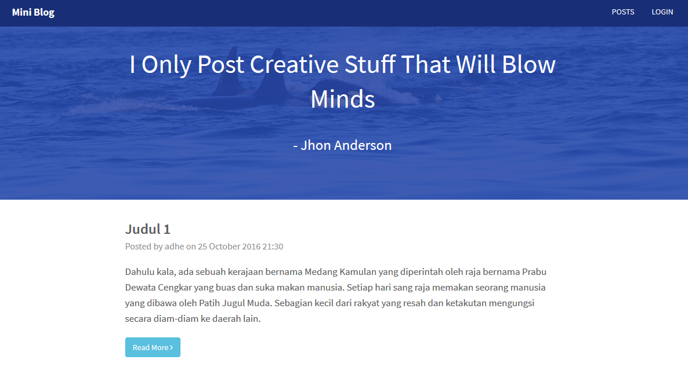
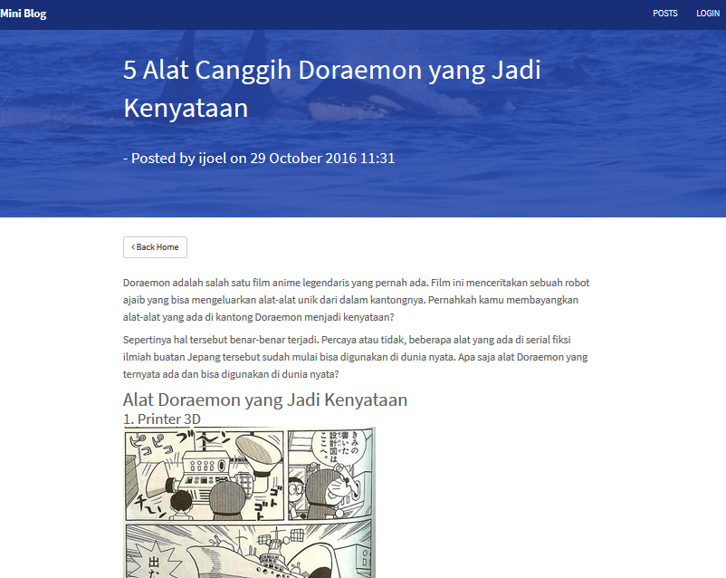
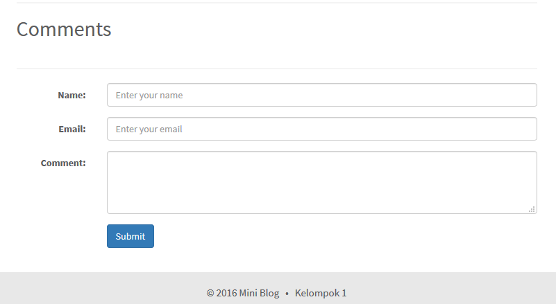

# Tugas IF4093 - Simple Blog

## Anggota Tim
 * 
 *

## Tampilan Aplikasi
1. Login

2. Manajemen Pengguna

3. List Post

4. Add/Edit Post
5. View Post

6. Komentar

## Prosedur Instalasi
WINDOWS, LINUX, MAC:
1. Install Web PHP + mysql database (ex:/ XAMPP, WAMP, etc) 
2. Pada folder instalasi, lakukan modifikasi pada file "php.ini" yang terletak pada [folder_instalasi]/php/:
    * Temukan parameter "session.cookie_httponly"
    * Ubah nilai menjadi "True" (tanpa tanda petik)
3. Run web service & mysql database
4. Execute miniblog_db.sql in mysql database
5. Deploy project-empty into web service (into htdocs(XAMPP)/www(WAMP))
6. Adjust database configuration in project-empty/src/config/db.php  
7. Address browser to http://localhost/project-empty/src/

